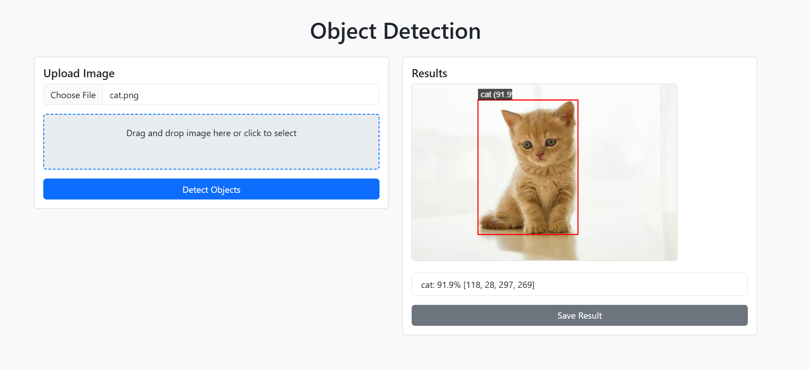

# Object Detection Flask Application

This repository contains a Flask-based web application for object detection using the YOLOv8 model from Ultralytics. The application allows users to upload images, perform object detection, and view results with bounding boxes and labels. Users can also save the detection results as PNG files.

<div>
    
</div>

## Features

- Upload an image and view detected objects with bounding boxes and confidence scores.
- Save the detection results as a PNG file.
- Supports 80 object classes from the COCO dataset.
- Responsive web interface with drag-and-drop image upload.

## Requirements

- Python 3.8+
- Flask==3.0.3
- Pillow==10.4.0
- numpy==1.26.4
- ultralytics==8.2.28
- torch==2.3.0
- torchvision==0.18.0

See `requirements.txt` for a complete list of dependencies.

## Setup

1. **Clone the repository**:
   ```bash
   git clone https://github.com/anhtuan23004/flask-object-detection.git
   cd flask-object-detection
   ```

2. **Create a virtual environment (recommended)**:
   ```bash
   python -m venv venv
   source venv/bin/activate  # Linux/Mac
   venv\Scripts\activate     # Windows
   ```

3. **Install dependencies**:
   ```bash
   pip install -r requirements.txt
   ```

4. **Download YOLOv8 weights**:
   The YOLOv8 model (`yolov8n.pt`) will be automatically downloaded by the `ultralytics` library on the first run. Alternatively, you can manually download it from [Ultralytics releases](https://github.com/ultralytics/assets/releases) and place it in the project directory.

5. **Project structure**:
   ```
   Object-Detection-Yolo-Flask/
   ├── app.py
   ├── backend/
   │   ├── tf_inference.py
   │   ├── config.py
   ├── static/
   │   ├── css/
   │   │   ├── styles.css
   │   ├── js/
   │   │   ├── script.js
   ├── templates/
   │   ├── index.html
   ├── requirements.txt
   ├── img1.png
   ```

## Running the Application

To start the Flask application, run:
```bash
python app.py
```
The application will be available at `http://localhost:5000`.

## Usage

### Image Upload and Detection
1. Open your browser and navigate to `http://localhost:5000`.
2. Upload an image file via the upload button or drag-and-drop.
3. Click "Detect Objects" to process the image.
4. View the detected objects with bounding boxes and labels on the canvas.
5. Click "Save Result" to download the detection result as a PNG file (`detection_result.png`).

## Troubleshooting
- **API errors**: Check Flask logs (`app.logger.error`) for issues with image processing or model inference.
- **Model loading**: Ensure `yolov8n.pt` is accessible or downloaded by `ultralytics`.
- **Large images**: Add size limits in `app.py` or `script.js` to prevent performance issues.
- **Browser compatibility**: The web interface uses Bootstrap 5.3 and modern JavaScript, compatible with recent browsers (Chrome, Firefox, Edge).

## Contributing
Feel free to submit issues or pull requests to improve the application. For feature requests or bug reports, please include detailed descriptions and logs.

## License
This project is licensed under the MIT License.
